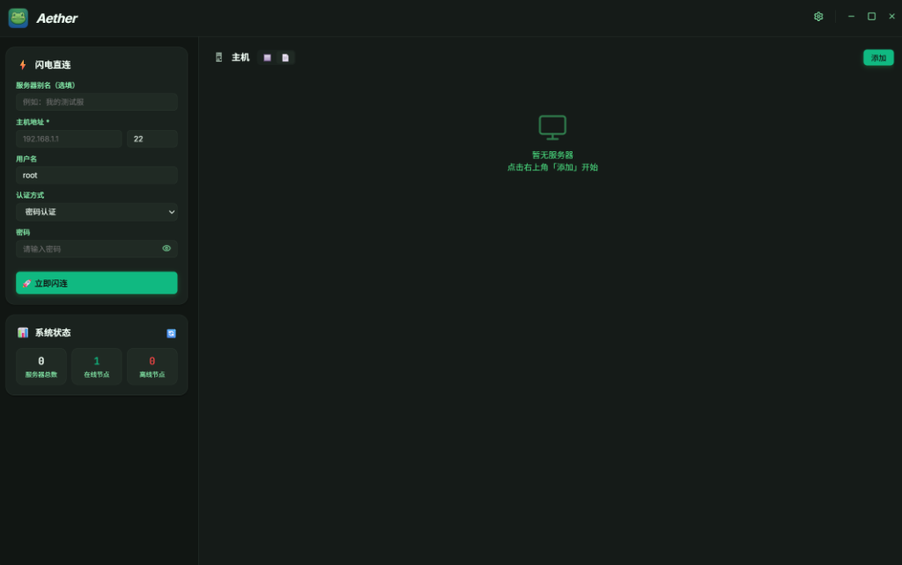
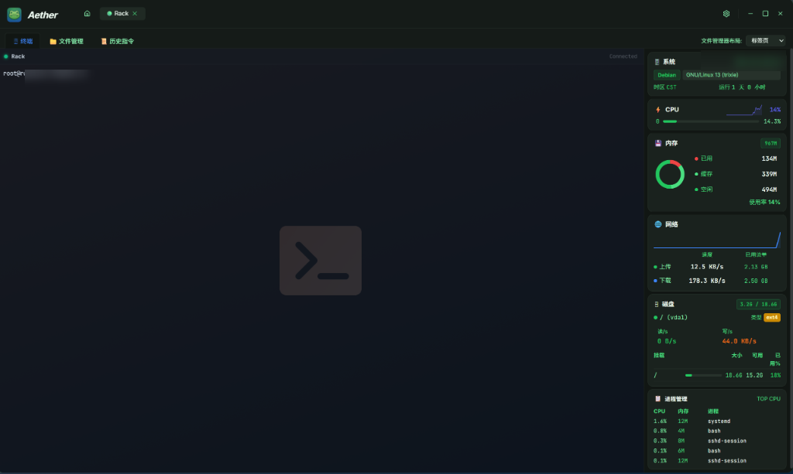
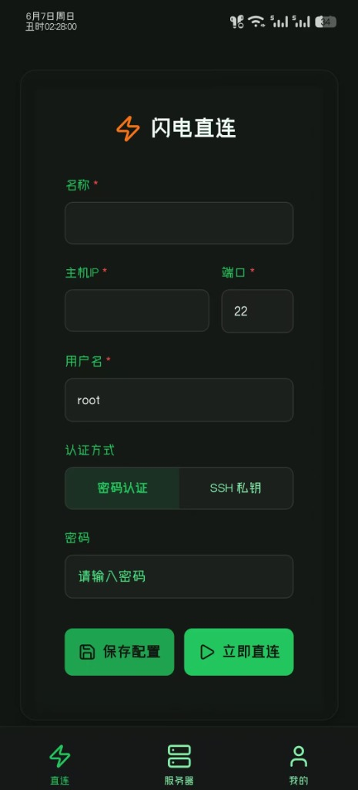

<div align="center">

# 🐸 Aether

**🔥 一个轻量级、高性能且极具设计感的多端跨平台 SSH 终端管理软件 🚀**

基于现代 Web 技术栈 (React 18 + Wails) 构建，主打极致的响应速度、高级拟态美学设计与多平台无缝数据漫游。

[](https://github.com/dag6608/Aether-SSH/releases)
[](https://github.com/dag6608/Aether-SSH/releases)
[](LICENSE)

[English](./README_EN.md) · [简体中文](./README.md)

</div>

<div align="center">
  <br/>
  
</div>

---

Aether 不仅仅是一个 SSH 客户端，它是一套为了消除繁杂运维痛点而生的极客工具链。我们抛弃了传统终端界面的简陋与刻板，将系统级的高性能探针与 Glassmorphism（玻璃拟态）设计语言完美融合。

<div align="center">
  <br/>
  
</div>

## ✨ 核心特性

- ⚡ **原生级全异步 PTY 引擎**
  - 后端基于 Go 原生并发处理 I/O，前端采用 `WebSocket` 与 `xterm.js` 构建极低延迟的通信轨道。
  - 支持 **预测本地回显 (Predictive Local Echo)** 机制，提供绝对丝滑、零卡顿的跟手输入与删除体验，即便在高延迟网络下依然畅快淋漓。
- 🎨 **Glassmorphism 玻璃拟态美学**
  - 全局沉浸式深/浅色动态主题，根据环境自适应流光溢彩。
  - 所有模态框与右键菜单均附带流畅的毛玻璃遮罩层与微动效过渡，摒弃一切粗糙的视觉交互。
- 📊 **系统级原生资源探针**
  - 无需额外部署复杂的服务端 Agent。直连后，自动挂载高性能原生监控面板。
  - 实时绘制毫秒级刷新率的 CPU 曲线、内存饼图及网络吞吐率表盘，掌控服务器状态于弹指间。
- 📐 **ResizeObserver 智能布局计算**
  - 终端面板原生集成 `ResizeObserver`，智能感知父级容器边界变动。
  - 无论您如何调整底部分屏、切换侧边栏，终端行列都能实现**零裁剪、零遮挡**的完美重绘。
- ☁️ **全时无缝 WebDAV 漫游**
  - 内置企业级 WebDAV 增量同步模块，每一次连接和配置修改都会生成高强度加密快照。多端登录，一键全自动恢复。
- 📱 **多终端跨平台拓展 (Android)**
  - 基于同一套现代设计语言，正在构建无缝接驳的移动生态，随时随地保持核心连接。

<div align="center">
  <br/>
  
</div>

---

## 🔒 军事级本地加密

所有的敏感连接信息与私钥文件，在首次启动时会由本机唯一指纹生成随机 32 位熵的 Master Key。无论是在本地磁盘还是传输至 WebDAV 的云端存储，均采用 **AES-GCM (256-bit)** 算法进行原子级隔离与加密，确保绝对的零信任安全。

---

## 🛠️ 构建指南

如需自行克隆与二次开发：

1. 环境依赖：**Go (1.20+)** 与 **Node.js (18+)**
2. 安装 Wails 开发框架：
   ```bash
   go install github.com/wailsapp/wails/v2/cmd/wails@latest
   ```
3. 本地启动热重载开发模式：
   ```bash
   git clone https://github.com/dag6608/Aether-SSH.git
   cd Aether-SSH/AetherSSH-Go
   wails dev
   ```

---

## 📜 许可证

本项目遵循 [MIT License](LICENSE) 协议开源。欢迎任何极客与我们共同完善属于工程师的终端美学！
